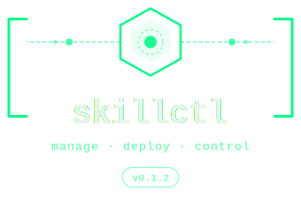

<p align="center">
  
</p>

<p align="center">
  <em>What kubectl does for Kubernetes, skillctl does for agent skills.</em>
</p>

<p align="center">
  <a href="https://github.com/dgallitelli/skillctl/actions/workflows/ci.yml"></a>
  
  
  
  
  
</p>

---

## The problem

Agent skills are spreading fast — code review skills, deployment skills, IaC security skills — but there's no quality gate between "someone wrote a SKILL.md" and "it's running in production." Teams end up with:

- Skills with **hardcoded secrets** or **prompt injection patterns** that nobody catches
- No way to answer **"does this skill actually help?"** with data
- The **same skill copy-pasted** across Claude Code, Cursor, Windsurf, and Kiro
- **Breaking changes** that ship without warning or versioning

**skillctl** is the governance layer. One CLI to validate, evaluate, optimize, publish, and distribute agent skills across any IDE and any runtime.

---

## Get started in 60 seconds

```bash
pip install skillsops

# Create your first skill
skillctl create skill my-org/code-reviewer
# Edit SKILL.md with your instructions, then:

skillctl validate                         # schema + semver check
skillctl eval audit .                     # security scan → A-F grade
skillctl apply                            # push to governed store
skillctl install my-org/code-reviewer@0.1.0 --target all   # deploy to every IDE
```

That's the full lifecycle: **create → validate → audit → publish → distribute.**

---

## Already have skills? Start here

If you already have skills in Claude Code, Cursor, or any IDE — no `skill.yaml` needed:

```bash
# Validate and audit an existing Claude Code skill
skillctl validate ~/.claude/skills/my-skill/SKILL.md
skillctl eval audit ~/.claude/skills/my-skill/

# Install it to other IDEs
skillctl install ~/.claude/skills/my-skill/ --target cursor,windsurf,kiro

# Or install from a URL
skillctl install --from-url https://raw.githubusercontent.com/.../SKILL.md --target all
```

Add a `skillctl:` block to your SKILL.md frontmatter for full governance metadata — IDEs ignore it, skillctl reads it:

```yaml
---
name: code-reviewer
description: Reviews code for security issues
allowed-tools: Read Grep
skillctl:
  namespace: my-org
  version: 1.2.0
  category: security
  tags: [security, code-review]
---
```

---

## What skillctl does

### Validate and scan

```bash
skillctl validate ./my-skill          # schema, semver, capabilities
skillctl eval audit ./my-skill        # security scan → A-F grade
```

The security scanner checks 9 threat categories (~50 pattern detectors): hardcoded secrets, prompt injection, data exfiltration URLs, unsafe deserialization, encoded payloads, and more. Skills with critical findings are **blocked from publishing**. Customize with `.skilleval.yaml` — run `skillctl eval init ./my-skill` to generate one.

### Evaluate with data

```bash
skillctl eval init ./my-skill         # generate eval scaffolds + .skilleval.yaml
skillctl eval functional ./my-skill   # runs agent with/without skill, measures difference
skillctl eval trigger ./my-skill      # does the skill activate when it should?
skillctl eval report ./my-skill       # unified score: 40% audit + 40% functional + 20% trigger
```

### Optimize automatically

```bash
skillctl optimize ./my-skill --budget 5.0
```

Iterative loop: evaluate → identify weaknesses via LLM → generate variants → re-evaluate → promote the best. Works with any LLM via [LiteLLM](https://docs.litellm.ai/docs/providers).

### Publish with governance

```bash
skillctl apply ./my-skill             # validate + security scan + push to store
```

Every mutation is versioned, diffable, and auditable:

```bash
skillctl bump --minor                 # 1.0.0 → 1.1.0
skillctl diff my-org/code-reviewer@1.0.0 my-org/code-reviewer@1.1.0
skillctl get skills                   # list everything in the store
skillctl describe skill my-org/code-reviewer@1.1.0
```

### Install to every IDE

```bash
skillctl install my-org/code-reviewer@1.1.0 --target all      # auto-detect IDEs
skillctl install my-org/code-reviewer@1.1.0 --target cursor    # specific IDE
skillctl install my-org/code-reviewer@1.1.0 --target kiro --global  # user-level
skillctl get installations                                     # what's installed where
skillctl uninstall my-org/code-reviewer@1.1.0 --target all     # clean up
```

Supported targets: **Claude Code**, **Cursor**, **Windsurf**, **GitHub Copilot**, **Kiro**. Frontmatter is automatically translated to each IDE's native format.

### Export, import, share

```bash
skillctl export --namespace my-org    # tar.gz archive of your skills
skillctl import skills-backup.tar.gz  # restore on another machine
```

---

## Key features

| Feature | What it does |
|---------|-------------|
| **Security scanning** | 9 threat categories, ~50 pattern detectors, A-F grading |
| **Functional evaluation** | With/without-skill baseline comparison via LLM-as-judge |
| **Trigger evaluation** | Activation recall and specificity measurement |
| **Automated optimization** | LLM-driven iterative improvement loop with budget control |
| **Multi-IDE install** | Install governed skills to Claude Code, Cursor, Windsurf, Copilot, Kiro |
| **SKILL.md first-class** | Works with bare SKILL.md files — no skill.yaml required for local ops |
| **Category taxonomy** | 12 built-in categories with validation |
| **Content-addressed storage** | SHA-256 hashing, integrity verification, structural diffing |
| **Version management** | `skillctl bump`, `skillctl diff`, breaking change detection |
| **Self-hosted registry** | FastAPI + SQLite + FTS5 search, HMAC-signed audit logs |
| **AWS Agent Registry** | Native integration via `bedrock-agentcore-control` API |
| **Claude Code plugin** | 14 MCP tools + 3 skills for governance inside agentic IDEs |
| **Export/import** | Portable skill archives for sharing and backup |

## How it fits in

```
Author writes skill
    → skillctl validate        (schema check)
    → skillctl eval audit      (security scan, A-F grade)
    → skillctl eval functional (behavioral testing)
    → skillctl optimize        (automated improvement)
    → skillctl apply           (push to governed store)
    → skillctl install         (distribute to IDEs)
    → Enterprise discovery     (self-hosted registry or AWS Agent Registry)
```

---

## Claude Code plugin

skillctl ships a [Claude Code plugin](https://code.claude.com/docs/en/plugins) in the `plugin/` directory. It gives Claude direct access to all skillctl operations via MCP tools.

```bash
claude --plugin-dir ./plugin

# 14 MCP tools: validate, apply, list, describe, delete, diff, create,
#   eval_audit, eval_functional, eval_trigger, eval_report,
#   optimize, optimize_history, install
#
# 3 skills: /skillctl:skill-lifecycle, /skillctl:create-skill, /skillctl:diagnose-skill
```

---

## Installation

```bash
pip install skillsops                  # core CLI (Python 3.10+)
pip install "skillsops[optimize]"      # + optimizer (LiteLLM)
pip install "skillsops[plugin]"        # + MCP server for Claude Code plugin
pip install "skillsops[server]"        # + registry server (FastAPI)
pip install "skillsops[all]"           # everything
```

Verify your setup:

```bash
skillctl doctor                       # checks Python, deps, store, registry, IDE targets
```

---

## Documentation

| Document | Purpose |
|----------|---------|
| [docs/REFERENCE.md](docs/REFERENCE.md) | Full CLI reference, skill format, registry server, eval suite, optimizer flags, API endpoints |
| [ARCHITECTURE.md](ARCHITECTURE.md) | System overview, module map, data flow diagrams |
| [CHANGELOG.md](CHANGELOG.md) | Version history and release notes |

## Development

```bash
python -m venv .venv && source .venv/bin/activate
pip install -e ".[dev,optimize,plugin]"
pytest -m "not integration"           # 530+ unit tests
pytest -m integration                 # 10 real Bedrock tests (needs AWS creds)
```

## License

[MPL-2.0](https://www.mozilla.org/en-US/MPL/2.0/)
