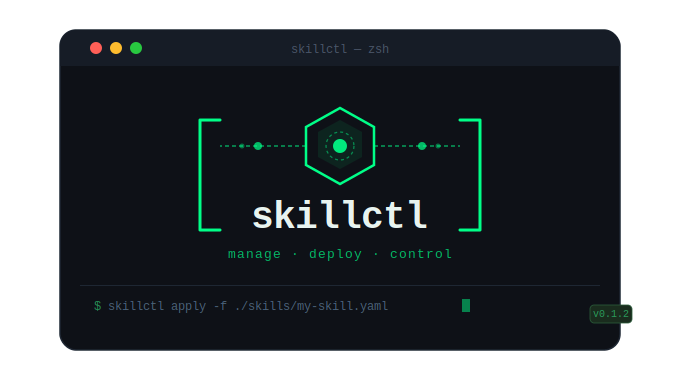

<p align="center">
  
</p>

<p align="center">
  <strong>skillctl</strong><br>
  <em>What kubectl does for Kubernetes, skillctl does for agent skills.</em>
</p>

<p align="center">
  <a href="#quickstart">Quickstart</a> ·
  <a href="#cli-reference">CLI Reference</a> ·
  <a href="#examples">Examples</a>  <br/>
  <a href="#registry-server">Registry Server</a> ·
  <a href="#eval-suite">Eval Suite</a> ·
  <a href="#skill-optimizer">Skill Optimizer</a>
</p>

---

**skillctl** is an open-source governance platform for agent skills. It gives platform teams a single tool to validate, evaluate, publish, audit, and enforce policy on skills across any agent runtime — Anthropic, OpenAI, Gemini, or any SKILL.md-based agent.

The platform has three layers:

- A **CLI** for local governance (validate, scan, push/pull, diff)
- A **self-hostable registry server** for team distribution (publish, search, audit)
- An **eval suite** that grades skills A–F across safety, quality, and reliability

No skill reaches production without passing through a governance gate. Every mutation is attributable, reversible, and auditable.

## Quickstart

### Install

Requires Python 3.10+.

```bash
pip install .
```

### Create your first skill

```bash
skillctl create skill my-org/my-skill
```

This scaffolds two files in the current directory:

- `skill.yaml` — the skill manifest (metadata, capabilities, parameters)
- `SKILL.md` — the skill instructions (what the agent should do)

### Validate

```bash
skillctl validate
```

Exit codes: `0` = valid, `1` = errors, `2` = warnings only. Add `--json` for CI-friendly output.

### Apply (validate + push)

```bash
skillctl apply
```

This validates the skill, pushes it to the local content-addressed store at `~/.skillctl/store/`, and — if a registry URL is configured — also publishes to the remote registry. Use `--local` to skip remote publish, or `--dry-run` to preview.

### Run a security audit

```bash
skillctl eval audit ./my-skill
```

Scans for secrets, prompt injection patterns, data exfiltration URLs, unsafe deserialization, base64 payloads, and more. Produces an A–F grade on a 100-point scale.

---

## Skill Format

Every skill is defined by a `skill.yaml` manifest and a `SKILL.md` instructions file.

### skill.yaml

```yaml
apiVersion: skillctl.io/v1
kind: Skill

metadata:
  name: my-org/code-reviewer
  version: 1.0.0
  description: "Reviews PRs for security issues and code quality"
  authors:
    - name: Alice
      email: alice@example.com
  license: MIT
  tags:
    - security
    - code-review

spec:
  content:
    path: ./SKILL.md
  parameters:
    - name: strictness
      type: enum
      values: ["low", "medium", "high"]
      default: "medium"
  capabilities:
    - read_file
    - read_code
  dependencies:
    - name: my-org/base-engineering
      version: ">=1.0.0 <2.0.0"

governance:
  approvals:
    required: 1
    from: ["owner", "admin"]
  channels:
    - my-org/engineering
```

### Backward compatibility

Plain `SKILL.md` files (no `skill.yaml`) are auto-detected and wrapped in a minimal manifest with a warning. You don't need to rewrite existing skills to adopt governance.

---

## CLI Reference

All commands follow kubectl-style verb patterns: `skillctl <verb> [resource] [args] [flags]`

### Core commands

| Command | Description |
|---------|-------------|
| `skillctl apply [path]` | Validate + push to local store; publish to remote if configured |
| `skillctl create skill <name>` | Scaffold a new skill (skill.yaml + SKILL.md) |
| `skillctl get skills` | List skills from local store (or remote with `--remote`) |
| `skillctl get skill <ref>` | Pull/show a specific skill by name@version |
| `skillctl describe skill <ref>` | Rich detail: metadata, versions, parameters, capabilities |
| `skillctl delete skill <ref>` | Remove a skill version from local store |
| `skillctl logs <name>` | Show audit trail for a skill (from registry) |
| `skillctl validate [path]` | Validate manifest structure, semver, capabilities |
| `skillctl diff <ref-a> <ref-b>` | Compare two skill versions with breaking change detection |
| `skillctl doctor` | Diagnose environment issues |
| `skillctl version` | Print version info |

### `apply` flags

| Flag | Description |
|------|-------------|
| `-f <path>` | Path to skill (alias for positional argument) |
| `--dry-run` | Preview without mutating state |
| `--local` | Skip remote publish, only push to local store |

### Registry commands

| Command | Description |
|---------|-------------|
| `skillctl serve` | Start the self-hosted registry server |
| `skillctl token create` | Create an API token for registry access |
| `skillctl login` | Authenticate with GitHub via device flow |
| `skillctl logout` | Remove stored GitHub credentials |
| `skillctl config set <key> <value>` | Configure registry URL and credentials |
| `skillctl config get <key>` | Read a configuration value |

Registry commands accept `--registry-url` and `--token` flags to override the configured values.

### Backward-compatible aliases

All old commands still work and map to the new kubectl-style equivalents:

| Old command | Maps to |
|-------------|---------|
| `skillctl init <name>` | `skillctl create skill <name>` |
| `skillctl push [path]` | `skillctl apply --local [path]` |
| `skillctl pull <ref>` | `skillctl get skill <ref>` |
| `skillctl list` | `skillctl get skills` |
| `skillctl publish [path]` | `skillctl apply [path]` |
| `skillctl search [query]` | `skillctl get skills --remote --query <query>` |

### Eval commands

| Command | Description |
|---------|-------------|
| `skillctl eval audit <path>` | Security & structure audit with A–F grading |
| `skillctl eval functional <path>` | Baseline comparison (with/without skill) |
| `skillctl eval trigger <path>` | Activation reliability testing |
| `skillctl eval report <path>` | Unified report (40% audit, 40% functional, 20% trigger) |
| `skillctl eval snapshot <path>` | Save current results as regression baseline |
| `skillctl eval regression <path>` | Detect score drops vs baseline |
| `skillctl eval compare <a> <b>` | Side-by-side skill comparison |
| `skillctl eval lifecycle <path>` | Version tracking and change detection |

### Optimizer commands

| Command | Description |
|---------|-------------|
| `skillctl optimize [path]` | Run automated improvement loop |
| `skillctl optimize history` | List past optimization runs |
| `skillctl optimize diff <run-id>` | Show original vs promoted diff |

### Common flags

- `--json` — JSON output (available on validate, list, diff, and eval commands)
- `--dry-run` — Preview without mutating state (push, optimize)
- `--strict` — Treat warnings as errors (validate)
- `--verbose` / `-v` — Show additional detail (eval audit)

---

## Registry Server

The registry server is a self-hostable FastAPI application backed by SQLite and filesystem blob storage. Zero external infrastructure dependencies — just Python and SQLite.

### Start with Docker

```bash
docker compose up
```

This starts the registry at `http://localhost:8080` with persistent data in `./registry-data/`.

### Start from CLI

```bash
skillctl serve --port 8080
```

Data is stored at `~/.skillctl/registry/` by default. Use `--data-dir` to override.

### Configure the CLI to use a registry

```bash
skillctl config set registry.url http://localhost:8080
skillctl config set registry.token <your-token>
```

Or use environment variables:

```bash
export SKILLCTL_REGISTRY_URL=http://localhost:8080
export SKILLCTL_REGISTRY_TOKEN=<your-token>
```

### Authentication

Token-based auth with scoped permissions:

- `read` — read-only access to all skills
- `write:<namespace>` — publish/delete within a namespace
- `admin` — full access, including token management

Create tokens via the API or CLI:

```bash
skillctl token create --name ci-publisher --scope write:my-org --scope read
```

Use `--expires` to set a token expiration (e.g. `--expires 90d`).

Use `--auth-disabled` for local development (not for production).

### API endpoints

```
GET    /api/v1/health                              # Health check
GET    /api/v1/skills                              # List/search skills
GET    /api/v1/skills/{namespace}/{name}            # Skill detail (latest version)
GET    /api/v1/skills/{namespace}/{name}/{version}  # Specific version
GET    /api/v1/skills/{namespace}/{name}/{version}/content  # Download content
POST   /api/v1/skills                              # Publish skill
DELETE /api/v1/skills/{namespace}/{name}/{version}  # Delete version
PUT    /api/v1/skills/{namespace}/{name}/{version}/eval  # Attach eval grade
POST   /api/v1/tokens                              # Create token
DELETE /api/v1/tokens/{token_id}                    # Revoke token
```

### Audit log

Every mutating operation (publish, delete, eval attach, token create/revoke) is logged to an append-only JSONL file at `<data-dir>/audit.jsonl`, signed with HMAC-SHA256.

### Web UI

The web UI is available on the `web-ui-feature` branch and can be merged in for a full browser-based experience. The v0.1.0 release is CLI-first.

### GitHub Storage Backend

Instead of storing skills on the local filesystem, the registry can use a GitHub repository as its backing store. Each skill version becomes a directory in the repo:

```
skills/
  my-org/
    code-reviewer/
      1.0.0/
        skill.yaml       # manifest
        content           # skill content (file or archive)
        metadata.json     # eval scores, timestamps
      1.1.0/
        ...
```

Every publish, delete, and eval update commits and pushes to the repo. You get full version history, collaboration via PRs, and the registry server is stateless — it just needs a fresh clone to start.

#### Setup

1. Create a GitHub repository for skill storage (e.g. `my-org/skill-registry`)

2. Register a GitHub OAuth App for device flow authentication:
   - Go to [github.com/settings/applications/new](https://github.com/settings/applications/new)
   - Set any name and homepage URL
   - Enable "Device Flow" in the app settings
   - Note the Client ID

3. Configure skillctl:

```bash
# Save the OAuth App client ID
skillctl config set github.client_id <your-client-id>

# Save the repository URL
skillctl config set github.repo https://github.com/my-org/skill-registry.git

# Authenticate via device flow (opens browser)
skillctl login
```

Use `--scopes` to request additional GitHub OAuth scopes (e.g. `--scopes repo,read:org`).

4. Start the registry with GitHub backend:

```bash
skillctl serve --storage github --auth-disabled
```

#### Configuration

The GitHub repo URL is resolved in this order: `--github-repo` flag > `SKILLCTL_GITHUB_REPO` env var > `github.repo` in config file.

The GitHub token is resolved in this order: `--github-token` flag > `SKILLCTL_GITHUB_TOKEN` env var > token from `skillctl login` in config file.

| Config key | Env var | CLI flag | Description |
|------------|---------|----------|-------------|
| `github.repo` | `SKILLCTL_GITHUB_REPO` | `--github-repo` | Repository HTTPS URL |
| `github.token` | `SKILLCTL_GITHUB_TOKEN` | `--github-token` | Access token (or use `skillctl login`) |
| `github.client_id` | `SKILLCTL_GITHUB_CLIENT_ID` | `--client-id (login)` | OAuth App client ID for device flow |
| `github.branch` | — | `--github-branch` | Git branch to use (default: main) |

#### How it works

- On startup, the registry clones (or pulls) the repo and rebuilds a local SQLite index for fast FTS search
- Publish writes files to the local clone, commits, and pushes
- Delete removes the version directory, commits, and pushes
- Eval updates write to `metadata.json`, commit, and push
- Reads are fast — they hit the local clone, not the GitHub API

---

## Eval Suite

The eval suite answers: "Does this skill actually make my agent better — and by how much?"

### Security audit

```bash
skillctl eval audit ./my-skill
```

Scans for:
- Hardcoded secrets (API keys, tokens, passwords, AWS keys, private keys)
- External URLs and data exfiltration risk surfaces
- Subprocess/shell execution patterns
- Unsafe dependency installation (curl|bash, unpinned pip install)
- Prompt injection surfaces
- Unsafe deserialization (pickle, marshal, yaml.load)
- Dynamic imports and code generation
- Base64 encoded payloads
- MCP server references
- Structure validation against the agentskills.io spec

Grading: 100-point scale → A (90+), B (80+), C (70+), D (60+), F (<60).

### Functional evaluation

```bash
skillctl eval functional ./my-skill --evals evals/evals.json
```

Runs an agent with and without the skill against defined test scenarios, comparing output quality via LLM-as-judge scoring.

### Trigger evaluation

```bash
skillctl eval trigger ./my-skill --queries evals/eval_queries.json
```

Tests whether the skill activates on relevant queries and stays silent on irrelevant ones.

### Unified report

```bash
skillctl eval report ./my-skill
```

Produces a combined score: 40% audit + 40% functional + 20% trigger. Maps to certification tiers:

| Grade | Certification | Meaning |
|-------|--------------|---------|
| A/B | Verified | Passes all governance gates |
| C | Community | Usable but has warnings |
| D/F | Rejected | Does not meet minimum quality bar |

### Regression detection

```bash
skillctl eval snapshot ./my-skill          # Save baseline
# ... make changes ...
skillctl eval regression ./my-skill        # Compare against baseline
```

### Configuration

Create a `.skilleval.yaml` in your skill directory to customize behavior:

```yaml
ignore:
  - STR-017    # Suppress specific finding codes
safe_domains:
  - api.mycompany.com
min_score: 70  # Fail if score drops below this
```

---

## Skill Optimizer

The optimizer closes the loop between evaluation and improvement. It runs an automated cycle: eval → failure analysis → LLM-generated variants → re-eval → promotion.

```bash
skillctl optimize ./my-skill --budget 5.0 --max-iterations 20
```

### How it works

1. Evaluates the current skill using the eval suite
2. Analyzes failures to identify weaknesses (via LLM)
3. Generates N candidate variants, each targeting a specific weakness
4. Evaluates each variant
5. Promotes the best variant if it exceeds the current score by a configurable threshold (default: +5%)
6. Repeats until plateau (no improvement for N cycles), budget exhaustion, or iteration cap

### Key flags

| Flag | Default | Description |
|------|---------|-------------|
| `--variants` | 3 | Number of candidate variants per cycle |
| `--threshold` | 0.05 | Minimum improvement to promote (5%) |
| `--max-iterations` | 50 | Hard cap on optimization cycles |
| `--plateau` | 3 | Stop after N cycles with no improvement |
| `--budget` | 10.0 | Maximum spend in USD |
| `--timeout` | 120 | Evaluation timeout in seconds |
| `--agent` | claude | Agent to use for evaluation |
| `--model` | auto | LLM model ID (provider-specific) |
| `--region` | us-east-1 | AWS region for Bedrock provider |
| `--provider` | bedrock | LLM provider (bedrock, anthropic) |
| `--approve` | false | Auto-approve promotions without confirmation |
| `--dry-run` | false | Run the loop without writing changes |

### Provenance

Every optimization run is stored at `~/.skillctl/optimize/<run-id>/` with full provenance: original content, each variant, failure analyses, eval reports, and promotion decisions.

```bash
skillctl optimize history                    # List all runs
skillctl optimize diff <run-id>              # Show what changed
```

---

## Examples

The `examples/` directory contains three skill examples:

| Example | Description |
|---------|-------------|
| `basic-skill/` | A complete skill with skill.yaml and SKILL.md |
| `parameterized-skill/` | Demonstrates typed parameters (string, enum, number, boolean) |
| `minimal-skill/` | A plain SKILL.md with no manifest (tests backward compatibility) |

Validate all examples:

```bash
skillctl validate examples/basic-skill
skillctl validate examples/parameterized-skill
skillctl validate examples/minimal-skill      # auto-wraps with warning
```

---

## Architecture

```mermaid
graph TD
    CLI[skillctl CLI]

    subgraph Core
        CLI --> Manifest[manifest.py<br/>skill.yaml parser]
        CLI --> Validator[validator.py<br/>schema + semver + capabilities]
        CLI --> Store[store.py<br/>content-addressed storage]
        CLI --> Diff[diff.py<br/>version comparison]
        CLI --> GitHubAuth[github_auth.py<br/>device flow OAuth]
    end

    subgraph Registry Server
        CLI -->|serve / publish / search| Server[server.py<br/>FastAPI app]
        Server --> API[api.py<br/>REST endpoints]
        API --> Auth[auth.py<br/>token-based auth]
        API --> DB[db.py<br/>SQLite + FTS5]
        API --> BlobStore[storage.py<br/>filesystem blobs]
        API --> GitBackend[github_backend.py<br/>git repo storage]
        API --> Audit[audit.py<br/>HMAC-signed JSONL]
    end

    subgraph Eval Suite
        CLI -->|eval| EvalCLI[eval/cli.py]
        EvalCLI --> AuditScan[audit/<br/>security scan]
        EvalCLI --> Functional[functional.py<br/>with/without comparison]
        EvalCLI --> Trigger[trigger.py<br/>activation reliability]
        EvalCLI --> Report[unified_report.py<br/>A-F grading]
        EvalCLI --> Regression[regression.py<br/>baseline comparison]
    end

    subgraph Optimizer
        CLI -->|optimize| OptLoop[loop.py<br/>improvement cycle]
        OptLoop --> FailureAnalyzer[failure_analyzer.py]
        OptLoop --> VariantGen[variant_generator.py]
        OptLoop --> PromotionGate[promotion_gate.py]
        OptLoop --> LLM[llm_client.py<br/>Bedrock / Anthropic]
        OptLoop --> Budget[budget.py<br/>cost tracking]
        OptLoop --> Provenance[provenance.py<br/>run history]
    end

    Store -.->|local| FS[(~/.skillctl/store)]
    DB -.-> SQLite[(SQLite)]
    GitBackend -.->|push/pull| GitHub[(GitHub Repo)]
    Audit -.-> AuditLog[(audit.jsonl)]
```



## Development

### Setup

```bash
python -m venv .venv
source .venv/bin/activate
pip install -e ".[dev]"
```

### Run tests

```bash
pytest
```

### Run the registry locally

```bash
skillctl serve --auth-disabled --port 8080
```

---

## Roadmap

| Milestone | Scope | Status |
|-----------|-------|--------|
| v0.1.0 | CLI + Local Governance → Registry Server → Eval Suite | Complete |
| v0.2.0 | Registry Governance → Publish policies, approvals, webhooks, deprecation | Not started |
| v0.3.0 | Automated Skill Optimization | Complete |

See [.planning/ROADMAP.md](.planning/ROADMAP.md) for detailed phase breakdowns.

## License

[MPL-2.0](https://www.mozilla.org/en-US/MPL/2.0/) — copyleft on files, permissive on linking.
