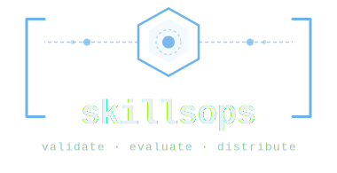

<p align="center">
  
</p>

<p align="center">
  <strong>The governance layer for agent skills.</strong>
</p>

<p align="center">
  <em>Validate, audit, version, deploy, and self-host agent skills.<br>
  One CLI for the whole lifecycle — what kubectl does for Kubernetes, skillctl does for skills.</em>
</p>

<p align="center">
  <a href="https://github.com/dgallitelli/skillsops/actions/workflows/ci.yml"></a>
  
  
  
  
  
</p>

---

## Why SkillsOps

A `SKILL.md` is a typed resource with a manifest, versioned content, capabilities,
and a lifecycle.  Treating it that way — instead of as "just a markdown file
that lives in a folder" — is the difference between a hobby project and
production governance.

SkillsOps gives that resource one CLI:

```bash
skillctl validate    ./my-skill        # schema, semver, capabilities
skillctl eval audit  ./my-skill        # security audit -> A-F grade
skillctl apply       ./my-skill        # push to a content-addressed store
skillctl bump        --minor           # 1.2.0 -> 1.3.0
skillctl diff        my-org/x@1.2.0 my-org/x@1.3.0
skillctl install     ./my-skill --target all   # deploy to every IDE
skillctl describe    skill my-org/x@1.3.0
skillctl logs        my-org/x          # audit trail from the registry
```

Skills are written in the **same `SKILL.md` format Anthropic uses** —
SkillsOps adds the governance layer so your team can keep them
**secure, private, and auditable on infrastructure you control**.  No
vendor lock-in, no requirement to host skills off-site.

---

## What's in the box

| Capability | Status | Why it's here |
|---|---|---|
| `validate` — schema, semver, capability checks | stable | Bad manifests should never reach the store. |
| `eval audit` — static security audit (9 categories, ~35 finding codes, ~70 regex patterns) | stable | Block leaked secrets, prompt injection, exfil URLs, unsafe deserialization, encoded payloads in CI. |
| `apply` / `get` / `describe` / `delete` / `diff` — content-addressed local store | stable | SHA-256 hashing, integrity verification, structural version diffs. |
| `bump` — semver version edits in `skill.yaml` | stable | `--major` / `--minor` / `--patch` with breaking-change detection. |
| `install` / `uninstall` — multi-IDE deploy (Claude Code, Cursor, Windsurf, Copilot, Kiro) | stable | One source SKILL.md, native frontmatter on every IDE. |
| `serve` — self-hosted FastAPI registry with token auth, hash-chained audit log | stable | Run governance on infra you control.  See [SECURITY.md](SECURITY.md) for the threat model. |
| `eval functional` / `eval trigger` — LLM-as-judge behavioural eval | beta | Measure whether the skill actually helps and triggers when it should. |
| `optimize` — automated improvement loop (eval → LLM critique → variants → promote) | experimental | Cost-capped, plateau-detecting; no published case study yet. |
| Claude Code MCP plugin (14 tools + 3 skills) | stable | Use SkillsOps from inside an agentic IDE. |
| `export` / `import` — portable archives | stable | Backup, share, migrate between hosts. |

---

## Self-hosted, by design

Skills often encode private prompts, internal IP, and security-sensitive
review rules.  Most teams don't want to ship those to a vendor:

```bash
# Run the registry on your own host (or a private VPC).
skillctl serve --hmac-key "$SKILLCTL_HMAC_KEY"

# Issue narrowly-scoped tokens to CI / authors.
skillctl token create --name ci-bot --scope read --scope write:my-org

# Push and pull through your own URL.
skillctl config set registry.url https://skills.internal.example.com
skillctl apply ./my-skill
```

The registry is FastAPI + SQLite + FTS5, stores blobs content-addressed
on the filesystem (or in a git repository), and signs every mutation
into a hash-chained audit log.  Tokens are SHA-256-hashed at rest;
namespace-scoped permissions enforce tenant isolation; rate limiting,
CORS, and TrustedHost middleware are on by default.  See
[SECURITY.md](SECURITY.md) for the full threat model and hardening
checklist.

---

## Audit in CI

```yaml
# .github/workflows/skill-audit.yml
name: Skill audit
on:
  pull_request:
    paths: ['**/SKILL.md', '**/skill.yaml']

jobs:
  audit:
    runs-on: ubuntu-latest
    steps:
      - uses: actions/checkout@v6
      - uses: actions/setup-python@v6
        with: { python-version: '3.13' }
      - run: pip install skillsops
      - run: skillctl eval audit ./skills/ --fail-on-warning
```

A copy-paste-ready template lives at
[examples/workflows/skill-audit.yml](examples/workflows/skill-audit.yml).
CRITICAL findings fail the build unconditionally.  Tune per-skill
suppressions with a `.skilleval.yaml` ([docs](docs/3-security-audit.md)).
The audit is *static* — an A grade means "no obvious issues against
~35 finding codes / ~70 regex patterns", not "safe to run untrusted".
Pair it with the LLM-as-judge functional eval for a fuller picture.

---

## Multi-IDE install — what it actually does

Each IDE has its own conventions:

| IDE          | Project path                         | Frontmatter |
|--------------|--------------------------------------|-------------|
| Claude Code  | `.claude/skills/<name>/SKILL.md`     | passthrough |
| Cursor       | `.cursor/rules/<name>.mdc`           | `description`, `globs`, `alwaysApply` |
| Windsurf     | `.windsurf/rules/<name>.md`          | `trigger: always_on \| glob \| manual \| model_decision` |
| GitHub Copilot | `.github/instructions/<name>.instructions.md` | `applyTo: "<glob>"` |
| Kiro         | `.kiro/steering/<name>.md`           | `inclusion`, `fileMatchPattern` |

`skillctl install` reads one source SKILL.md and writes the right file
with the right frontmatter to every target you ask for — no copy-paste
drift.

```bash
skillctl install ./my-skill --target all                    # auto-detect
skillctl install ./my-skill --target cursor,windsurf,kiro   # specific
skillctl install ./my-skill --target claude --global        # user-level
skillctl uninstall ./my-skill --target all
```

---

## Install

```bash
pip install skillsops                  # core CLI
pip install "skillsops[server]"        # + the registry server
pip install "skillsops[optimize]"      # + LLM-driven optimizer
pip install "skillsops[plugin]"        # + MCP server for Claude Code plugin
pip install "skillsops[all]"           # everything
```

Python 3.10+.  The core CLI has only one dependency (`pyyaml`); the
server, optimizer, and plugin are optional extras.

---

## 60-second tour

```bash
# Author from scratch.
skillctl create skill my-org/code-reviewer
# (edit SKILL.md)

# Validate and audit.
skillctl validate
skillctl eval audit .

# Push to your local content-addressed store.
skillctl apply

# Deploy to every IDE in the workspace.
skillctl install my-org/code-reviewer@0.1.0 --target all

# Or, working from an existing SKILL.md:
skillctl validate   ~/.claude/skills/code-reviewer/SKILL.md
skillctl eval audit ~/.claude/skills/code-reviewer/
skillctl install    ~/.claude/skills/code-reviewer/ --target cursor,windsurf,kiro
```

`apply --local` accepts a bare-name skill (no namespace) for the local
store.  Only the **remote registry** requires a namespaced name like
`my-org/code-reviewer`, because that store is shared.

---

## What this replaces

If you don't use SkillsOps, the typical alternative is a hand-rolled
pipeline:

| Without SkillsOps | With SkillsOps |
|---|---|
| Bash script that copies SKILL.md to `.claude/skills/`, `.cursor/rules/`, `.windsurf/rules/`, `.github/instructions/`, `.kiro/steering/`, each with different frontmatter | `skillctl install ./my-skill --target all` |
| `gitleaks` + a list of "things people said agents shouldn't do" + a CI script | `skillctl eval audit --fail-on-warning` |
| `bumpversion` config + a `git tag` script + ad-hoc changelog | `skillctl bump`, `skillctl diff`, `skillctl logs` |
| Skills shipped to a vendor, or no central store at all | `skillctl serve` on your own host |
| `promptfoo` config + custom harness | `skillctl eval functional` (beta — promptfoo / inspect-ai are more mature today) |
| LLM eval loop someone wrote one weekend | `skillctl optimize` (experimental — research preview) |

The wedge is the **integration**: one resource model, one error model,
one config, one CLI, one audit trail.  Each individual capability has
mature standalone alternatives — what those don't give you is the
shared lifecycle.

---

## Documentation

| Document | Purpose |
|----------|---------|
| [docs/0-architecture.md](docs/0-architecture.md) | System overview, module map, data flow diagrams |
| [docs/1-skill-format.md](docs/1-skill-format.md) | Full CLI reference, skill format, registry server, eval suite, optimizer flags, API endpoints |
| [docs/3-security-audit.md](docs/3-security-audit.md) | Audit categories, severities, suppression workflow |
| [SECURITY.md](SECURITY.md) | Threat model, controls, and how to report vulnerabilities |
| [CONTRIBUTING.md](CONTRIBUTING.md) | How to set up a dev environment and send a PR |
| [CHANGELOG.md](CHANGELOG.md) | Version history and release notes |

---

## Verify your setup

```bash
skillctl doctor    # Python, deps, store, registry, IDE targets
skillctl version   # current version
```

---

## Development

```bash
python -m venv .venv && source .venv/bin/activate
pip install -e ".[dev,optimize,plugin]"
pytest -m "not integration"      # unit tests
pytest -m integration            # real Bedrock tests (needs AWS creds)
```

See [CONTRIBUTING.md](CONTRIBUTING.md) for project conventions.

---

## Status

Beta (`0.1.x`).  The core CLI surface (`apply`, `install`, `validate`,
`eval audit`, `bump`, `diff`, `get`, `describe`, `delete`, `serve`,
`logs`) is stable and covered by 600+ unit tests plus a
real-Bedrock integration suite.  The optimizer, the registry's REST API
shape, and the `skillctl:` frontmatter block may change before `1.0.0`
based on user feedback.

## License

[MPL-2.0](LICENSE) — see the [LICENSE](LICENSE) file for the full text.
