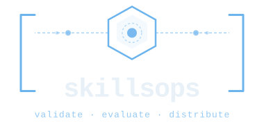

<p align="center">
  
</p>

<p align="center">
  <strong>The governance layer for agent skills.</strong>
</p>

<p align="center">
  <em>Validate, audit, version, deploy, and self-host agent skills.<br>
  One CLI for the whole lifecycle — what kubectl does for Kubernetes, skillctl does for skills.</em>
</p>

<p align="center">
  <a href="https://github.com/dgallitelli/skillsops/actions/workflows/ci.yml"></a>
  
  
  
  
</p>

---

## Why SkillsOps

A `SKILL.md` is a typed resource with a manifest, versioned content, capabilities,
and a lifecycle.  Treating it that way — instead of as "just a markdown file
that lives in a folder" — is the difference between a hobby project and
production governance.

SkillsOps gives that resource one CLI:

```bash
skillctl validate    ./my-skill        # schema, semver, capabilities
skillctl eval audit  ./my-skill        # security audit -> A-F grade
skillctl apply       ./my-skill        # push to a content-addressed store
skillctl bump        --minor           # 1.2.0 -> 1.3.0
skillctl diff        my-org/x@1.2.0 my-org/x@1.3.0
skillctl install     ./my-skill --target all   # deploy to every IDE
skillctl describe    skill my-org/x@1.3.0
skillctl logs        my-org/x          # audit trail from the registry
```

Skills are written in the **same `SKILL.md` format Anthropic uses** —
SkillsOps adds the governance layer so your team can keep them
**secure, private, and auditable on infrastructure you control**.  No
vendor lock-in, no requirement to host skills off-site.

---

## What's in the box

| Capability | Status | Why it's here |
|---|---|---|
| `validate` — schema, semver, capability checks | stable | Bad manifests should never reach the store. |
| `eval audit` — static security audit (9 categories, ~35 finding codes, ~70 regex patterns; `--strict` adds an AST pass for Python) | stable | Block leaked secrets, prompt injection, exfil URLs, unsafe deserialization, encoded payloads in CI. |
| `apply` / `get` / `describe` / `delete` / `diff` — content-addressed local store | stable | Deterministic complete-skill bundles, per-file SHA-256 integrity, structural version diffs. |
| `bump` — semver version edits in `skill.yaml` | stable | `--major` / `--minor` / `--patch` with breaking-change detection. |
| `install` / `uninstall` — multi-IDE deploy (Claude Code, Cursor, Windsurf, Copilot, Kiro) | stable | One source SKILL.md, native frontmatter on every IDE. |
| `serve` — self-hosted FastAPI registry with token auth, hash-chained audit log | stable | Run governance on infra you control.  See [SECURITY.md](SECURITY.md) for the threat model. |
| `auth` / `rbac` / `namespace` — role-based access control | stable | Users, 4 roles, hierarchical namespaces, scoped tokens; every decision audited.  See [docs/rbac.md](docs/rbac.md). |
| `policy` / `observe` — opt-in policy and telemetry libraries | experimental | Useful hooks, but the registry and installed agent runtimes do not invoke them automatically. See [docs/runtime-policy.md](docs/runtime-policy.md). |
| `compliance` — framework control-mapping previews | experimental | Deterministic, non-certifying gap analysis; not a trusted compliance or promotion gate. See [docs/compliance.md](docs/compliance.md). |
| `deploy` — local rollout state-machine model | experimental | Models routing and rollback in SQLite; it does not control live registry or runtime traffic. See [docs/deployment.md](docs/deployment.md). |
| `identity` / `forensics` / federation | experimental | Local HS256 inspection, caller-recorded lineage queries, and a programmatic registry-copy helper; trust boundaries are not integrated. See [docs/enterprise.md](docs/enterprise.md). |
| `ci` — CI/CD starter templates | preview | Review, pin, and adapt generated pipelines before production use. |
| `eval report` — deterministic governance score (80% security audit + 20% schema contract) | stable | Reproducible: same inputs always yield the same score. |
| Claude Code MCP plugin (5 core tools: validate, audit, bump, diff, publish) | stable | Use SkillsOps from inside an agentic IDE. |
| `export` / `import` — portable archives | stable | Backup, share, migrate between hosts. |

---

## Self-hosted, by design

Skills often encode private prompts, internal IP, and security-sensitive
review rules.  Most teams don't want to ship those to a vendor:

```bash
# Run the registry on your own host (or a private VPC).
skillctl serve --hmac-key "$SKILLCTL_HMAC_KEY"

# Issue narrowly-scoped tokens to CI / authors.
skillctl token create --name ci-bot --scope read --scope write:my-org

# Push and pull through your own URL.
skillctl config set registry.url https://skills.internal.example.com
skillctl apply ./my-skill
```

The registry is FastAPI + SQLite + FTS5, stores blobs content-addressed
on the filesystem (or in a git repository), and signs every mutation
into a hash-chained audit log.  Tokens are SHA-256-hashed at rest;
namespace-scoped permissions enforce tenant isolation; rate limiting,
CORS, and TrustedHost middleware are on by default.  See
[SECURITY.md](SECURITY.md) for the full threat model and hardening
checklist. The current persistence design is single-process: a second
registry process or worker using the same data directory is refused at
startup.

For a local container deployment:

```bash
docker compose up --build
```

The Compose file uses a named volume for `/data`. It generates and persists an
audit HMAC key when `SKILLCTL_HMAC_KEY` is absent; production deployments
should inject that variable from a secrets manager.

---

## Audit in CI

```yaml
# .github/workflows/skill-audit.yml
name: Skill audit
on:
  pull_request:
    paths: ['**/SKILL.md', '**/skill.yaml']

jobs:
  audit:
    runs-on: ubuntu-latest
    steps:
      - uses: actions/checkout@v6
      - uses: actions/setup-python@v6
        with: { python-version: '3.13' }
      - run: pip install skillsops
      - run: skillctl eval audit ./skills/ --fail-on-warning --format=github
```

A copy-paste-ready template lives at
[examples/workflows/skill-audit.yml](examples/workflows/skill-audit.yml).
CRITICAL findings fail the build unconditionally.

`--format=github` emits Actions workflow commands so each finding shows
up as an inline annotation on the offending line of the SKILL.md in the
PR diff.  GitHub caps inline annotations at 10 per level per run, so
quiet noisy categories with `.skilleval.yaml` if you hit it.  Tune per-skill
suppressions with a `.skilleval.yaml` ([docs](docs/3-security-audit.md)).
The audit is *static* — an A grade means "no obvious issues against
~35 finding codes / ~70 regex patterns", not "safe to run untrusted".
`skillctl eval report` combines it with deterministic schema-contract
validation (80% audit + 20% contract) for a reproducible governance score.

---

## Multi-IDE install — what it actually does

Each IDE has its own conventions:

| IDE          | Project path                         | Frontmatter |
|--------------|--------------------------------------|-------------|
| Claude Code  | `.claude/skills/<name>/SKILL.md`     | passthrough |
| Cursor       | `.cursor/rules/<name>.mdc`           | `description`, `globs`, `alwaysApply` |
| Windsurf     | `.windsurf/rules/<name>.md`          | `trigger: always_on \| glob \| manual \| model_decision` |
| GitHub Copilot | `.github/instructions/<name>.instructions.md` | `applyTo: "<glob>"` |
| Kiro         | `.kiro/steering/<name>.md`           | `inclusion`, `fileMatchPattern` |

`skillctl install` writes the right primary file and frontmatter for every
target. Complete artifact support files are installed beside `SKILL.md` for
Claude Code. Single-file IDE formats retain them in a versioned
`.skillctl-artifacts/` sidecar and report that location explicitly.

```bash
skillctl install ./my-skill --target all                    # auto-detect
skillctl install ./my-skill --target cursor,windsurf,kiro   # specific
skillctl install ./my-skill --target claude --global        # user-level
skillctl uninstall ./my-skill --target all
```

---

## Install

```bash
pip install skillsops                  # core CLI
pip install "skillsops[server]"        # + the registry server
pip install "skillsops[plugin]"        # + MCP runtime for the separately installed Claude Code plugin
pip install "skillsops[observability]" # + OpenTelemetry tracing
pip install "skillsops[policy-opa]"    # + OPA policy integration
pip install "skillsops[all]"           # everything

# The LLM-driven optimizer is now a separate, optional package:
pip install skillsops-optimize         # authoring-time optimizer (pulls in litellm)
```

Python 3.10+.  The core CLI has only one dependency (`pyyaml`); the
server and plugin are optional extras.  The optimizer ships separately
(`skillsops-optimize`) because authoring assistance is a different
concern from governance gatekeeping.

---

## 60-second tour

```bash
# Author from scratch.
skillctl create skill my-org/code-reviewer
# (edit SKILL.md)

# Validate and audit.
skillctl validate
skillctl eval audit .

# Push to your local content-addressed store.
skillctl apply

# Deploy to every IDE in the workspace.
skillctl install my-org/code-reviewer@0.1.0 --target all

# Or, working from an existing SKILL.md:
skillctl validate   ~/.claude/skills/code-reviewer/SKILL.md
skillctl eval audit ~/.claude/skills/code-reviewer/
skillctl install    ~/.claude/skills/code-reviewer/ --target cursor,windsurf,kiro
```

`apply --local` accepts a bare-name skill (no namespace) for the local
store.  Only the **remote registry** requires a namespaced name like
`my-org/code-reviewer`, because that store is shared.

---

## What this replaces

If you don't use SkillsOps, the typical alternative is a hand-rolled
pipeline:

| Without SkillsOps | With SkillsOps |
|---|---|
| Bash script that copies SKILL.md to `.claude/skills/`, `.cursor/rules/`, `.windsurf/rules/`, `.github/instructions/`, `.kiro/steering/`, each with different frontmatter | `skillctl install ./my-skill --target all` |
| `gitleaks` + a list of "things people said agents shouldn't do" + a CI script | `skillctl eval audit --fail-on-warning` |
| `bumpversion` config + a `git tag` script + ad-hoc changelog | `skillctl bump`, `skillctl diff`, `skillctl logs` |
| Skills shipped to a vendor, or no central store at all | `skillctl serve` on your own host |
| Ad-hoc "does the schema look right?" review before merging | `skillctl eval report` (deterministic 80% audit + 20% contract) |

The wedge is the **integration**: one resource model, one error model,
one config, one CLI, one audit trail.  Each individual capability has
mature standalone alternatives — what those don't give you is the
shared lifecycle.

---

## Documentation

| Document | Purpose |
|----------|---------|
| [docs/0-architecture.md](docs/0-architecture.md) | System overview, module map, data flow diagrams |
| [docs/1-skill-format.md](docs/1-skill-format.md) | Full CLI reference, skill format, registry server, eval suite, API endpoints |
| [docs/3-security-audit.md](docs/3-security-audit.md) | Audit categories, severities, suppression workflow |
| [docs/rbac.md](docs/rbac.md) | RBAC: roles, permissions, namespaces, CLI, bootstrap, audit |
| [docs/runtime-policy.md](docs/runtime-policy.md) | Experimental opt-in policy hooks and OpenTelemetry |
| [docs/compliance.md](docs/compliance.md) | Experimental non-certifying control mappings |
| [docs/deployment.md](docs/deployment.md) | Experimental local rollout state model |
| [docs/enterprise.md](docs/enterprise.md) | Experimental identity, ABAC, lineage, forensics, and federation utilities |
| [SECURITY.md](SECURITY.md) | Threat model, controls, and how to report vulnerabilities |
| [CONTRIBUTING.md](CONTRIBUTING.md) | How to set up a dev environment and send a PR |
| [CHANGELOG.md](CHANGELOG.md) | Version history and release notes |

---

## Verify your setup

```bash
skillctl doctor    # Python, deps, store, registry, IDE targets
skillctl version   # current version
```

---

## Development

```bash
python -m venv .venv && source .venv/bin/activate
pip install -e ".[dev,server,plugin,observability]"
pytest tests/ -m "not integration"  # unit and local integration tests
pytest tests/e2e                   # real local filesystem/server/crypto E2E
```

See [CONTRIBUTING.md](CONTRIBUTING.md) for project conventions.

---

## Status

Beta (`0.1.0b9`).  The core CLI surface (`apply`, `install`, `validate`,
`eval audit`, `eval report`, `bump`, `diff`, `get`, `describe`, `delete`,
`serve`, `logs`) is covered by 795 non-E2E tests and 43 real local
end-to-end tests.  The registry's REST API
shape and the `skillctl:` frontmatter block may change before `1.0.0`
based on user feedback.  The optimizer now lives in the separate
`skillsops-optimize` package with its own test and dependency lifecycle.

## License

[MPL-2.0](LICENSE) — see the [LICENSE](LICENSE) file for the full text.
