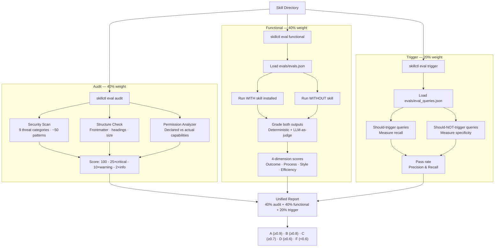

# Evaluation Suite

The `skillctl eval` commands grade skills A-F across three dimensions: **audit** (static security and structure analysis), **functional** (behavior testing against an agent runtime), and **trigger** (activation precision and recall). A unified report combines them into a single weighted score.

## Architecture



## Audit Evaluation

Runs without any LLM calls — pure static analysis.

### Security Scan (`SEC-001` through `SEC-009`)

See [3-security-audit.md](3-security-audit.md) for the full threat pattern catalog.

| Code | Category | Severity | What It Detects |
|------|----------|----------|-----------------|
| SEC-001 | Secrets | CRITICAL | API keys, tokens, passwords, connection strings, private keys |
| SEC-002 | URLs | WARNING/INFO | External URLs not on the safe domain allowlist |
| SEC-003 | Subprocess | WARNING/INFO | subprocess, os.system, eval/exec, shell=True |
| SEC-004 | Installs | CRITICAL/WARNING | pip install, npm install, curl\|sh, wget\|sh |
| SEC-005 | Injection | WARNING | Unbounded input handling, arbitrary code execution, unscoped writes |
| SEC-006 | Deserialization | CRITICAL/WARNING | pickle, marshal, shelve, yaml.load without SafeLoader |
| SEC-007 | Dynamic imports | WARNING | importlib, \_\_import\_\_, compile(), types.FunctionType |
| SEC-008 | Base64 payloads | CRITICAL/WARNING | base64.b64decode, atob(), long encoded strings near eval/exec |
| SEC-009 | MCP references | CRITICAL/WARNING | mcpServers config, npx -y, MCP/SSE endpoint URLs |

### Structure Check (`STR-001` through `STR-021`)

| Code | What It Checks |
|------|----------------|
| STR-001–003 | Directory exists, SKILL.md exists, SKILL.md readable |
| STR-004 | Valid YAML frontmatter |
| STR-005–008 | `name` field: required, ≤64 chars, lowercase+hyphens, matches directory |
| STR-009–011 | `description` field: required, ≤1024 chars, ≥20 chars |
| STR-012–013 | Optional fields: compatibility ≤500 chars, metadata is a mapping |
| STR-014–015 | Progressive disclosure: SKILL.md ≤500 lines, body ≤5000 tokens |
| STR-016 | README.md conflict warning |
| STR-017 | Scripts missing shebang line |
| STR-018 | Name contains reserved words (anthropic, claude) |
| STR-019 | Description contains XML tags |
| STR-020 | Description uses first/second person instead of third person |
| STR-021 | Body exceeds 4000-token recommended budget |

### Permission Analysis (`PERM-001` through `PERM-005`)

| Code | What It Checks |
|------|----------------|
| PERM-001 | Unrestricted Bash/Shell access in allowed-tools |
| PERM-002 | High-risk tools declared (e.g., Execute, HttpRequest) |
| PERM-003 | Excessive number of allowed-tools (>15) |
| PERM-004 | Instructions imply broad permissions (sensitive dirs, sudo, credentials) |
| PERM-005 | References to absolute system paths outside workspace |

### Scoring Formula

```
score = 100 - (25 × critical_count) - (10 × warning_count) - (2 × info_count)
```

| Grade | Score Range |
|-------|-------------|
| A | 90–100 |
| B | 80–89 |
| C | 70–79 |
| D | 60–69 |
| F | < 60 |

### Configuration (`.skilleval.yaml`)

Place a `.skilleval.yaml` in the skill directory to customize audit behavior:

```yaml
audit:
  ignore:
    - SEC-002          # Suppress specific finding codes
    - STR-016

  severity_overrides:
    SEC-003: info      # Downgrade subprocess findings to INFO

  safe_domains:
    - internal.company.com
    - registry.npmjs.org
```

## Functional Evaluation

Tests whether the skill improves agent behavior on real tasks. Requires an agent runtime (default: Claude Code).

### Test Case Format (`evals/evals.json`)

```json
[
  {
    "id": "test-security-review",
    "prompt": "Review this Python file for security issues",
    "expected_output": "Should identify the SQL injection vulnerability",
    "files": ["fixtures/vulnerable.py"],
    "assertions": [
      "mentions SQL injection",
      "suggests parameterized queries",
      "does not recommend string formatting for queries"
    ]
  }
]
```

| Field | Required | Description |
|-------|----------|-------------|
| `id` | Yes | Unique test case identifier |
| `prompt` | Yes | The user query to send to the agent |
| `expected_output` | No | Description of expected behavior (used by LLM grading) |
| `files` | No | Fixture files to copy into the workspace (relative to evals/) |
| `assertions` | No | Specific checks to grade the output against |

### How It Works

For each test case, the runner executes the prompt twice in isolated temporary workspaces:

1. **With skill**: SKILL.md + scripts/ + references/ + assets/ are copied into the workspace.
2. **Without skill**: Clean workspace, same prompt, no skill content.

Both outputs are graded against the assertions using deterministic pattern matching and optional LLM-as-judge. The differential measures the skill's contribution.

### 4-Dimension Scoring

| Dimension | What It Measures | How It's Computed |
|-----------|------------------|-------------------|
| **Outcome** | Did it solve the problem? | Assertion pass rate with skill |
| **Process** | Was the reasoning sound? | Tool call ratio (with/without skill) |
| **Style** | Does it match guidelines? | Assertion pass rate (style assertions are a subset) |
| **Efficiency** | Resource usage | Pass rate per token (normalized via sigmoid) |

Overall functional score = mean of all four dimensions.

### Cost-Efficiency Classification

The functional eval also classifies the skill's cost/quality tradeoff:

| Classification | Meaning |
|----------------|---------|
| PARETO_BETTER | Improves quality AND reduces cost |
| TRADEOFF | Improves quality but increases cost |
| CHEAPER_BUT_WEAKER | Reduces cost but also reduces quality |
| PARETO_WORSE | Increases cost without improving quality |
| REJECT | Significantly degrades quality (>5% drop) |

## Trigger Evaluation

Tests whether the skill activates at the right time — and stays silent when it should.

### Query Format (`evals/eval_queries.json`)

```json
[
  {"query": "Review this PR for security issues", "should_trigger": true},
  {"query": "What's the weather today?", "should_trigger": false}
]
```

Each query runs 3 times (configurable via `--runs`). Trigger detection uses a two-tier signal model:

- **Strong signal (tool-based)**: Agent read SKILL.md, invoked the Skill tool, or executed skill scripts via Bash.
- **Weak signal (text-based)**: Agent mentioned the skill name or scripts in its text output.

For should-trigger queries, either signal counts. For should-NOT-trigger queries, only strong signals count (text mentions are too noisy to penalize).

### Pass Criteria

- Should-trigger: pass if trigger rate ≥ 50% across runs
- Should-NOT-trigger: pass if trigger rate < 50% across runs

## Unified Report

Combines all three dimensions with dynamic weight redistribution:

```
Base weights: audit=40%, functional=40%, trigger=20%

If a component is skipped (no evals.json, no eval_queries.json):
  Its weight is redistributed proportionally to the remaining components.

Example: audit only → audit gets 100%
Example: audit + functional → audit=50%, functional=50%
Example: all three → audit=40%, functional=40%, trigger=20%
```

## CLI Usage

```bash
# Individual evaluations
skillctl eval audit ./my-skill           # Static analysis only (no LLM)
skillctl eval functional ./my-skill      # Behavior testing (requires agent)
skillctl eval trigger ./my-skill         # Activation testing (requires agent)

# Unified report
skillctl eval report ./my-skill          # Runs all applicable phases
skillctl eval report ./my-skill --format json   # JSON output
skillctl eval report ./my-skill --format html   # HTML report

# Options
skillctl eval functional . --runs 3              # Multiple runs for stability
skillctl eval functional . --dry-run             # Validate test cases only
skillctl eval audit . --include-all              # Scan entire directory tree
skillctl eval report . --skip-audit              # Skip audit phase

# Regression testing
skillctl eval snapshot .                 # Capture baseline
skillctl eval regression .              # Compare against baseline
```

## Key Source Files

| File | Role |
|------|------|
| `skillctl/eval/cli.py` | Eval orchestration and audit pipeline |
| `skillctl/eval/audit/security_scan.py` | 9 threat categories, ~50 regex patterns |
| `skillctl/eval/audit/structure_check.py` | Frontmatter, naming, size validation |
| `skillctl/eval/audit/permission_analyzer.py` | Capability over-privilege detection |
| `skillctl/eval/functional.py` | With/without skill comparison, 4-dimension scoring |
| `skillctl/eval/trigger.py` | Activation precision/recall measurement |
| `skillctl/eval/grading.py` | Deterministic + LLM-as-judge assertion grading |
| `skillctl/eval/unified_report.py` | Weighted aggregation, letter grading |
| `skillctl/eval/regression.py` | Baseline snapshot and degradation detection |
| `skillctl/eval/cost.py` | Token cost estimation per provider |
