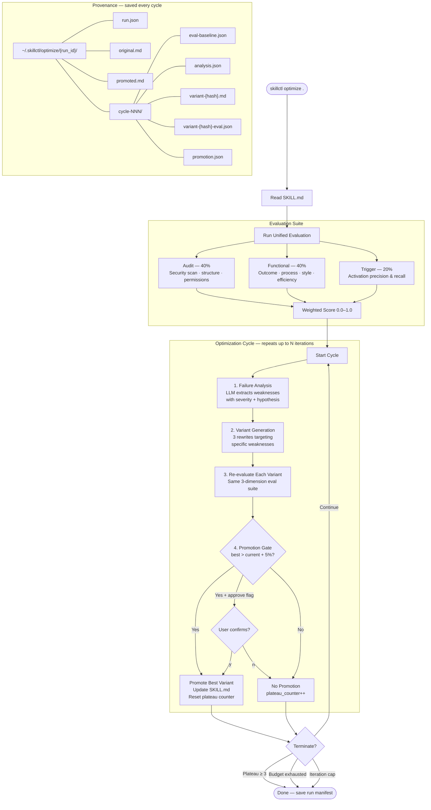

# Optimization Loop

The `skillctl optimize` command runs an iterative improvement loop that evaluates a skill, diagnoses weaknesses, generates improved variants, and promotes the best one — repeating until the skill plateaus, the budget runs out, or the iteration cap is reached.

## How It Works



## Phase Breakdown

### 1. Failure Analysis

The LLM receives the current SKILL.md and structured evidence from the evaluation (audit findings, failing functional dimensions, low trigger pass rates). It returns a ranked list of weaknesses:

| Field | Description |
|-------|-------------|
| `category` | `audit`, `functional`, or `trigger` |
| `description` | Human-readable explanation |
| `severity` | `high`, `medium`, or `low` |
| `evidence` | Specific findings or failing assertions |
| `hypothesis` | Proposed change to fix the weakness |

Weaknesses are sorted by severity (high first). If the LLM call fails, the cycle is skipped gracefully.

### 2. Variant Generation

The generator produces N candidates (default 3), each targeting a specific weakness via round-robin assignment. When there are more variants than weaknesses, assignments wrap around (variant 1 → weakness 1, variant 2 → weakness 2, variant 3 → weakness 3, variant 4 → weakness 1, ...).

Each variant is a complete SKILL.md rewrite. The LLM is instructed to make targeted changes addressing the hypothesis while preserving the skill's core purpose and structure. Variants are identified by SHA-256 content hash for deduplication.

### 3. Re-evaluation

Every variant runs through the same unified evaluation suite (audit + functional + trigger) that scored the baseline. The eval runner temporarily swaps the variant content into SKILL.md, runs the eval, and restores the original — guaranteed even if evaluation raises an exception.

### 4. Promotion Gate

The best-scoring variant is promoted only if:

1. It has a valid (non-None) score
2. Its score exceeds `current_score + threshold` (default 5%)
3. The user approves (when `--approve` is set)

If promoted, the variant becomes the new baseline for the next cycle and SKILL.md is updated on disk (unless `--dry-run`). If not promoted, the plateau counter increments.

## Termination Conditions

The loop exits on whichever condition is met first:

| Condition | Default | Description |
|-----------|---------|-------------|
| **Plateau** | 3 cycles | Consecutive non-improving cycles |
| **Budget** | configurable | Cumulative token cost exceeds USD limit |
| **Iteration cap** | 50 | Maximum number of cycles |

## Budget Tracking

Every LLM call (failure analysis + variant generation) is tracked with provider-specific pricing. The budget tracker maintains per-cycle and cumulative totals. When the budget is exhausted mid-cycle, the loop breaks after the current phase completes.

## Provenance

Every cycle persists its full state to `~/.skillctl/optimize/{run_id}/`:

```
{run_id}/
├── run.json                     # Full run manifest (config, scores, status)
├── original.md                  # Baseline SKILL.md before optimization
├── promoted.md                  # Final SKILL.md after optimization (if changed)
└── cycle-001/
    ├── eval-baseline.json       # Evaluation at cycle start
    ├── analysis.json            # Failure analysis output
    ├── variant-a1b2c3.md        # Variant content
    ├── variant-a1b2c3-eval.json # Variant evaluation result
    └── promotion.json           # Promotion decision + reasoning
```

Review past runs with `skillctl optimize history` and compare changes with `skillctl optimize diff {run_id}`.

## CLI Usage

```bash
# Basic optimization (defaults: 50 iterations, 3 variants, 5% threshold)
skillctl optimize .

# With budget cap and human approval
skillctl optimize . --budget 5.0 --approve

# Preview without writing changes
skillctl optimize . --dry-run

# Tune parameters
skillctl optimize . --max-iterations 20 --variants 5 --threshold 0.03

# Review results
skillctl optimize history
skillctl optimize diff abc123def456
```

## Key Source Files

| File | Role |
|------|------|
| `skillctl/optimize/loop.py` | Cycle orchestration |
| `skillctl/optimize/failure_analyzer.py` | LLM-driven weakness extraction |
| `skillctl/optimize/variant_generator.py` | LLM-powered SKILL.md rewriting |
| `skillctl/optimize/promotion_gate.py` | Score-based promotion logic |
| `skillctl/optimize/eval_runner.py` | Eval suite wrapper with content swapping |
| `skillctl/optimize/budget.py` | Token cost tracking and enforcement |
| `skillctl/optimize/provenance.py` | Per-cycle persistence and audit trail |
